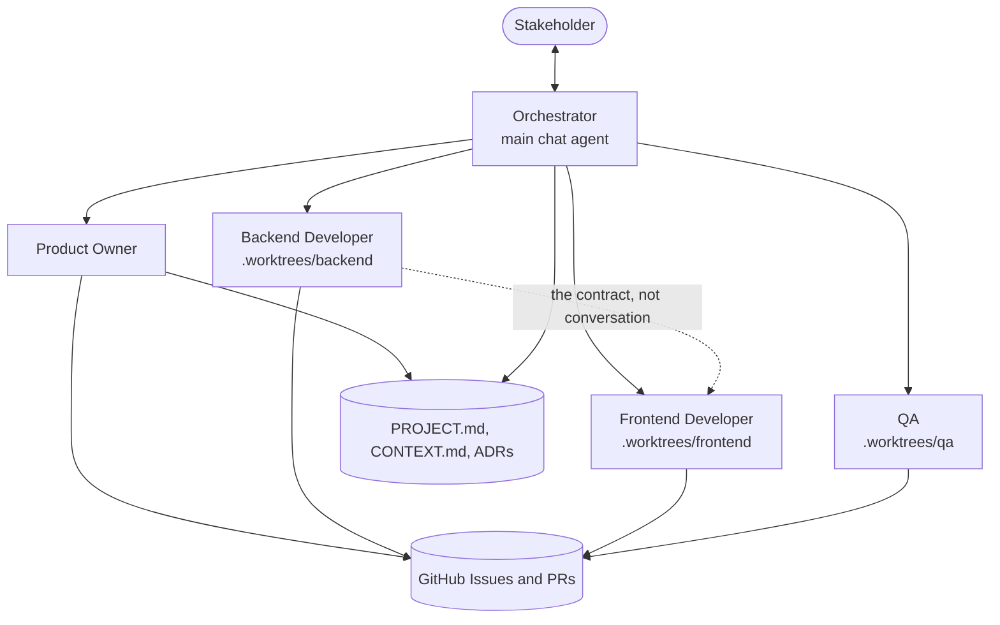

# The roles

Five roles, and the reasoning behind the shape.

## Orchestrator

**The main chat agent, defined by `AGENTS.md`.** Not a subagent, and this is not
a stylistic choice: a Cursor subagent runs once and returns a single message. It
cannot ask you something, wait, and carry on. Only the main agent can hold a
conversation, so the role whose entire job is talking to you has to be the main
agent.

It asks you questions, routes domain questions to the right specialist, records
decisions as ADRs, arbitrates the shared zone, and merges. It owns no state
transitions and writes no production code.

It also pesters. Any ADR still `status: proposed` is raised at the start of every
turn until you decide, because a proposed ADR is a decision the team has already
made in practice but not in agreement, and work quietly accumulates on top of it.

## Product Owner

Owns what gets built and in what order. Turns requirements into milestones,
epics, stories and tasks; grooms `triage` into `ready`; sequences work to keep
unblocked work available; and is the sole writer of `CONTEXT.md`.

That last point matters more than it looks. A ubiquitous language is only worth
having if one authority reconciles it. Other agents propose terms as individual
files in `docs/context/proposals/` — one file per proposal, so parallel worktrees
never conflict — and the Product Owner folds them in, resolving synonyms and
rejecting duplicates.

## Backend and Frontend Developers

Two specialists so that independent work can run in parallel. Each is confined to
its own git worktree on its own branch.

**They never talk to each other.** Subagents are isolated one-shot runs with no
channel between them, so instead of pretending otherwise the design makes the
interface explicit: they agree a machine-readable contract in `docs/contracts/`,
and that file is the single source of truth for both. Neither needs to ask the
other anything during implementation, because the contract already answered it.
Changing the contract is a deliberate event that the orchestrator applies.

Both plan before implementing, posting the plan on the issue. Neither proceeds on
an assumption: an unresolved question parks the issue with `blocked:stakeholder`
and the developer takes the next unblocked one rather than idling.

If the chosen stack is a monolith, the split becomes layer ownership rather than
path ownership — domain, data and HTTP against templates, assets and client-side
behaviour. Bootstrap records which, as explicit globs, in `.sdlc/state.json`.

## QA

Verifies against the acceptance criteria, not against the implementation's own
account of itself. Reads the criteria before the diff, actually runs the
application, and drives a browser for anything with a UI.

QA is **not** read-only, deliberately. Cursor's `readonly: true` blocks
state-changing shell commands as well as file edits, which would leave QA unable
to run a test suite — a code reviewer, not QA. Instead it can execute anything
and write test code, and is kept out of production source by the gate, which
rejects a `qa/` branch that touched it.

It can commit a failing test to demonstrate a defect, which is worth
considerably more to a developer than a paragraph of prose. It owns integration
and end-to-end coverage; developers own unit tests for their own code.

QA is the only role that can move an issue to `done`.

## Why not more roles, or fewer

A DevOps or security specialist is tempting, and both were left out on purpose.
Every additional role adds a dispatch decision the orchestrator can get wrong,
and their concerns are better handled as standards that apply to everyone — which
is what `.cursor/rules/engineering-standards.mdc` and the pre-PR gate are.

Fewer roles collapses the separation that makes the design work. QA that is also
the developer approves its own work.
